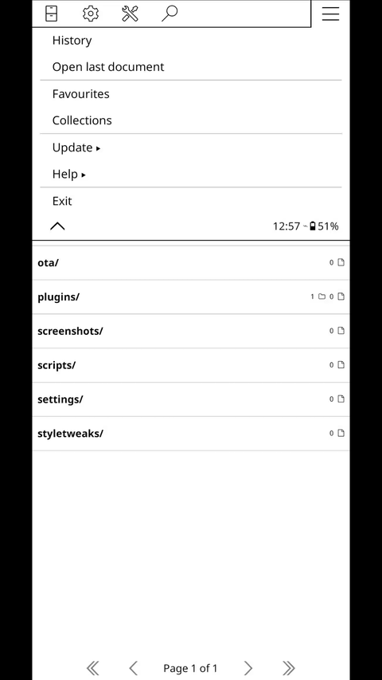

# [Calibre Web Automated Book Downloader Plugin](https://github.com/ZlibraryKO/zlibrary.koplugin)

**Disclaimer:** This plugin was creating forking the wonderful [KOReader Z-library Plugin](https://github.com/ZlibraryKO/zlibrary.koplugin), 95% of the work was made by it's developer.

Access your [Calibre Web Automated Book Downloader](https://github.com/calibrain/calibre-web-automated-book-downloader) using the KOReader application. This plugin allows you to browse and download content your Calibre Web Automated instance which then you can access using the OPDS browser within KOReader.

If you find this plugin helpful, please consider supporting the original developer of the [KOReader Z-library Plugin](https://github.com/ZlibraryKO/zlibrary.koplugin). The link bellow is if you want to make a donation to him, not me! (I don't accept donations for this plugin because I barely did anything!)

<a href="https://buymeacoffee.com/zlibraryko" target="_blank"></a>

## Demo

<div align="center">
  
</div>


## Features

*   Search [CWA Book Downloader](https://github.com/calibrain/calibre-web-automated-book-downloader) instance for books.
*   Filter search results by language and file extension.
*   Browse the queue and cancel any download.


## Prerequisites

*   KOReader installed on your device.
*   A [CWABD](https://github.com/calibrain/calibre-web-automated-book-downloader) instance.

## Installation

1.  Download the latest release.
2.  Copy the `plugins/calibredownloader.koplugin` directory to the `koreader/plugins` folder on your device.
3.  Restart KOReader.

## Configuration

There are two ways to configure the plugin:

**1. Via the KOReader User Interface (UI):**

1.  Ensure you are in the KOReader file browser.
2.  Access the "Search" menu.
3.  Select "CWA Book Downloader" (it's probably on the second page of this menu).
4.  Select "Settings".
5.  Enter your base URL for your CWABD instance.
6.  If you are using authentication, please put the username and password.
7.  Adjust other settings if needed.

**2. Via a Credentials File (Advanced):**

For a more permanent or automated setup, you can create a file named `cwabd_credentials.lua` in the root of the `cwabd.koplugin` directory (e.g., `koreader/plugins/cwabd.koplugin/cwabd_credentials.lua`).

This file allows you to override the credentials set in the UI. If this file exists and is correctly formatted, the plugin will use the values from this file.

Create the `cwbd_credentials.lua` file with the following content, uncommenting and filling in the details you wish to use:

```lua
-- This file allows you to override CWABD credentials.
-- Uncomment and fill in the details you want to override.
-- Values set here will take precedence over those set in the plugin's UI.

return {
    -- baseUrl = "http://your.cwabd.domain.com",
    -- username = "your_username", -- Optional param if you have auth enabled
    -- password = "your_password", -- Optional param if you have auth enabled
}
```

**Note:** Credentials set in the `cwabd_credentials.lua` file will always take precedence over those set via the UI. The plugin loads these settings at startup.

## Setup gesture (optional)

To easily access this plugin, you can set up a gesture to open the search menu:

1.  Open the top menu and tap the **Cog (⚙️)** icon.
2.  Navigate to **Taps and gestures** > **Gesture manager**.
3.  Select your desired gesture in two steps.
4.  Under **General**, find **CWA Book Downloader search** on the last page and check the box.


## Localization Support

This plugin provides basic support to localizations (only english for now).

## Usage

1.  Ensure you are in the KOReader file browser.
2.  Access the "Search" menu.
3.  Select "CWA Book Downloader".
4.  Select "Search" and enter your search query.

## Keywords

KOReader, Calibre Web Automated, Calibre Web Automated Book Downloader, e-reader, plugin, ebook, download, KOReader plugin, cwa integration, digital library, e-ink, bookworm, reading, open source.
